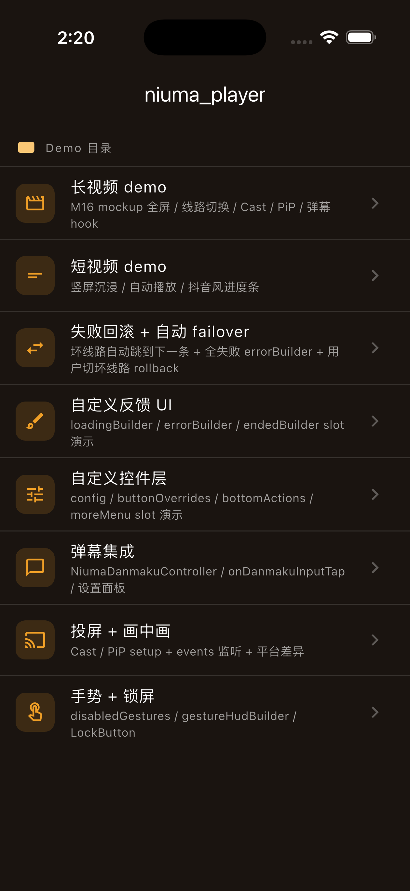
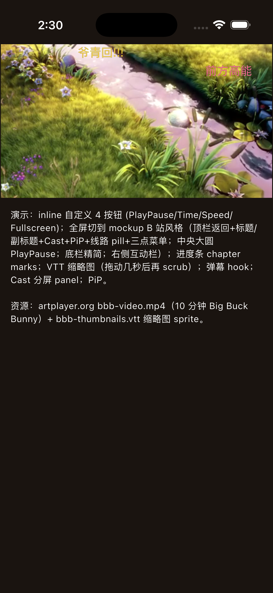
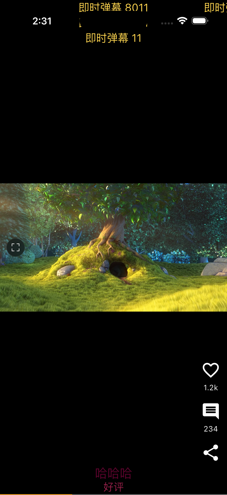
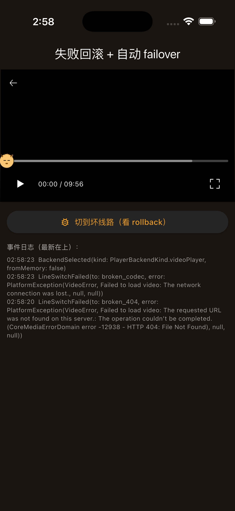
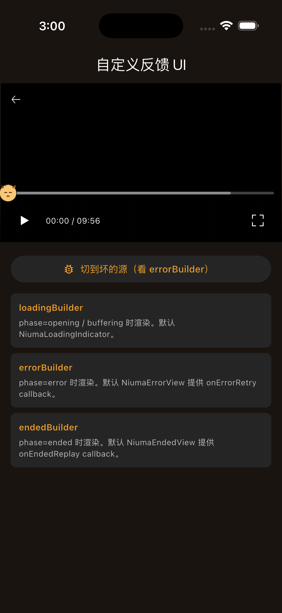
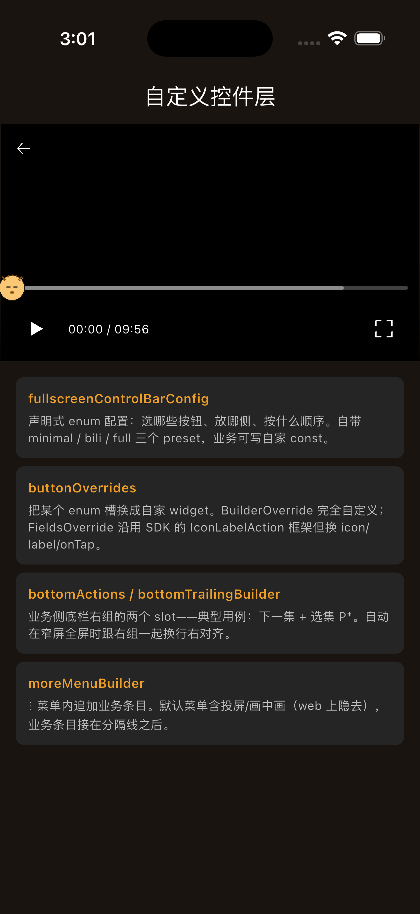
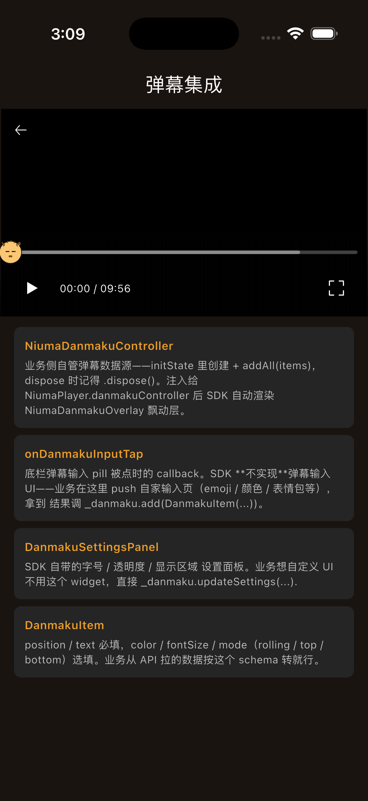
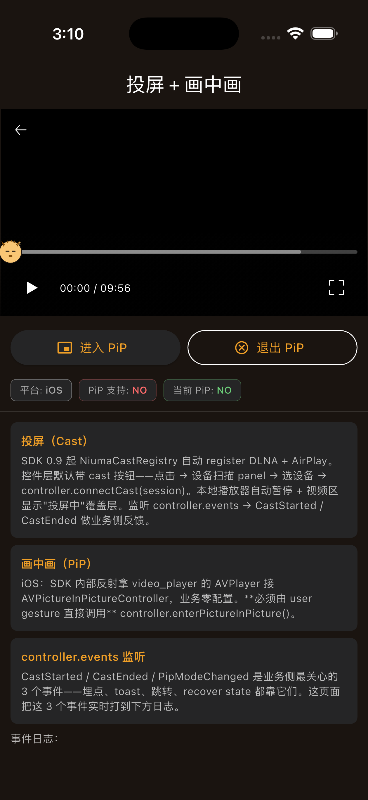
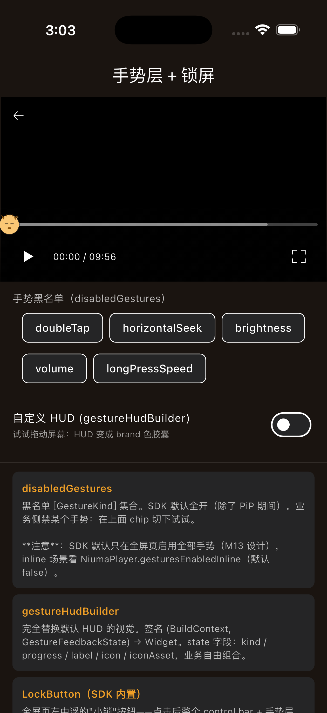

# niuma_player

[](LICENSE)
[](https://flutter.dev)

生产级 Flutter 视频播放器 SDK——**iOS / Android / Web 三端**统一 API，开箱即用 UI（长视频 bili 风 + 短视频抖音风），多线路自动 failover / 失败回滚，弹幕、画中画、投屏全套内置。

---

## 目录

- [特性](#特性)
- [平台兼容](#平台兼容)
- [安装](#安装)
- [5 行快速上手](#5-行快速上手)
- [8 个 Demo 速览](#8-个-demo-速览)
- [核心 API 速查](#核心-api-速查)
- [平台原生接入](#平台原生接入)
- [Web 平台已知限制](#web-平台已知限制)
- [常见问题](#常见问题)
- [发版与版本控制](#发版与版本控制)

---

## 特性

### 播放引擎
- **三端统一 controller**：`NiumaPlayerController.value` 在 iOS / Android / Web 暴露相同的 phase / size / position / errors API
- **互斥状态机**：`opening` → `ready` → `playing` ⇄ `paused` ⇄ `buffering` → `ended` / `error`，UI 不再靠 `isBuffering && !isPlaying` 拼布尔判断
- **结构化错误**：`PlayerErrorCategory.network / codecUnsupported / terminal` 等，不靠正则匹配错误字符串
- **Android 自动 fallback**：ExoPlayer → IJK，失败设备指纹持久化到 `SharedPreferences`，下次直接走 IJK——华为 / 旧设备 codec 缺位场景透明兜底

### 多线路 + 失败策略（v0.9.1+）
- **`autoFailoverOnInitialError`**（默认开）：默认线路 init 失败 → 按 `MediaLine.priority` 升序遍历下一条，全失败再 emit error
- **`rollbackOnSwitchFailure`**（默认开）：用户主动切换线路失败 → 静默回滚到原线路保留 position / wasPlaying
- **`switchLine(lineId)`**：业务侧主动切换 API，emit `LineSwitching` / `LineSwitched` / `LineSwitchFailed` 事件

### UI 套装
- **`NiumaPlayer`**：长视频外壳，bili 风 mockup 全屏 + inline 模式，支持自定义 ControlBarConfig / ButtonOverrides / 三态反馈 builder slot
- **`NiumaShortVideoPlayer`**：短视频抖音风外壳，PageView 翻页 / 单击 toggle / 长按 2x / 抖音式底部细进度条 / 沉浸式弹幕
- **`NiumaFullscreenPage`**：route push 全屏页，按视频比例**自动锁方向**（竖直视频 → 竖屏；横屏 → 横屏）；web 上不可锁但浮"旋转屏幕"提示
- **抖音风 seek HUD**：拖动快进 / 快退浮在屏幕中央，brand 橙方向箭头 + 30pt 大字 target 时间 + dim 总时长 + 细进度条
- **底栏智能 layout**：按 config 估算总自然宽度——单行 Row + Spacer / 双行 Column 自动切换

### 内置功能
- **弹幕系统**：`NiumaDanmakuController` + `NiumaDanmakuOverlay` + `DanmakuSettingsPanel`（字号 / 透明度 / 显示区域 %）
- **画中画**：iOS / Android 程序触发，零原生代码（iOS 反射 AVPlayer，Android 业务侧 1 行接入）
- **投屏**：DLNA + AirPlay，自动 register（业务零配置），可叠 Chromecast 等自家协议
- **缩略图**：M8 WebVTT 缩略图轨道——拖动 ScrubBar 时浮预览图
- **手势层**：5 种手势（horizontalSeek / brightness / volume / longPressSpeed / doubleTap），可白名单 / 自定义 HUD / 锁屏

### 反馈 UI 自定义（v0.8+）
- **`loadingBuilder` / `errorBuilder` / `endedBuilder`**：phase=opening|buffering / error / ended 时渲染业务自家 UI
- **`onErrorRetry` / `onEndedReplay`**：默认 UI 的回调（业务自定义 UI 可忽略）
- **`NiumaProgressThumb.iconBuilder`**：拖动进度条时的 thumb 头像

---

## 平台兼容

| 平台 | 后端 | HLS | PiP | 投屏 | 全屏锁方向 |
|---|---|:-:|:-:|:-:|:-:|
| **iOS** | AVPlayer (`video_player`) | ✅ 原生 | ✅ 反射 AVPlayer | ✅ AirPlay | ✅ |
| **Android** | ExoPlayer ↔ IJK (自家 plugin) | ✅ 原生 | ✅ 业务 1 行接入 | ✅ DLNA | ✅ |
| **Safari (PWA)** | 自家 `<video>` element | ✅ 原生 | ⚠️ 隐藏（user gesture 限制） | ⚠️ 隐藏 | ⚠️ no-op + 旋转提示 |
| **Chrome / Firefox / Edge** | 自家 `<video>` element | ✅ hls.js（内置自动注入） | ⚠️ 隐藏 | ⚠️ 隐藏 | ⚠️ no-op + 旋转提示 |

---

## 安装

```yaml
dependencies:
  niuma_player:
    git:
      url: https://github.com/axin789/niuma_player.git
      ref: main
```

---

## 5 行快速上手

```dart
import 'package:niuma_player/niuma_player.dart';

final controller = NiumaPlayerController.dataSource(
  NiumaDataSource.network('https://example.com/video.mp4'),
);
await controller.initialize();
controller.play();

// 在 widget 树里：
NiumaPlayer(controller: controller);
```

完整接入指南：[`doc/getting-started.md`](doc/getting-started.md)
完整 API 参考：[`doc/api-reference.md`](doc/api-reference.md)

---

## 8 个 Demo 速览

`example/` 是一个完整的 catalog app，从主页 `_Home` 选择各 demo 入口。运行：
```bash
cd example && flutter run
```

> 想直接进某个 demo（不用从主页点）：`flutter run --dart-define=DEMO=long_video`，可选 `long_video` / `short_video` / `rollback` / `feedback` / `controls` / `danmaku` / `cast_pip` / `gesture`。

### Catalog 主页



8 个 demo 入口列表——brand 橙圆角 icon container + 中文标题 + 简要说明。

### 1 · 长视频



bili 风 mockup 控件层 / 多线路切换 / Cast / PiP / 弹幕 hook / VTT 缩略图（拖进度条预览）。

源码：[`example/lib/long_video_demo_page.dart`](example/lib/long_video_demo_page.dart)

### 2 · 短视频



抖音风 PageView 翻页 / 单击 toggle play/pause / 长按 2x 倍速 / 抖音式底部细进度条 / 沉浸式弹幕 / 业务侧 overlayBuilder（点赞 / 评论 / 分享）。

源码：[`example/lib/short_video_demo_page.dart`](example/lib/short_video_demo_page.dart)

### 3 · 失败回滚 + 自动 failover



故意配 3 条线路：line1 / line2 是坏 URL，line3 是好的。截图捕获了 init 时 SDK 自动 fail 过两条最后落到好线路的事件日志。**业务方只需 0 行代码就拿到这个能力**——`NiumaPlayerOptions.autoFailoverOnInitialError` 默认 `true`。

源码：[`example/lib/rollback_failover_demo.dart`](example/lib/rollback_failover_demo.dart)

### 4 · 自定义反馈 UI



`loadingBuilder` / `errorBuilder` / `endedBuilder` 三态 slot——业务自家 widget 替换 SDK 默认渲染。点"切到坏的源"按钮触发 errorBuilder。

源码：[`example/lib/custom_feedback_ui_demo.dart`](example/lib/custom_feedback_ui_demo.dart)

### 5 · 自定义控件层



声明式 `NiumaControlBarConfig` 选 button / 排顺序；`buttonOverrides` 把单个 button 换成自家 widget；`bottomActionsBuilder` / `bottomTrailingBuilder` / `moreMenuBuilder` 业务侧追加。

源码：[`example/lib/custom_controls_demo.dart`](example/lib/custom_controls_demo.dart)

### 6 · 弹幕集成



`NiumaDanmakuController` 创建 + `addAll(items)` + `add(single)`；`NiumaPlayer.danmakuController` 透传；`onDanmakuInputTap` 接业务自家弹幕输入 dialog；`DanmakuSettingsPanel` bottomSheet 弹出。

源码：[`example/lib/danmaku_demo.dart`](example/lib/danmaku_demo.dart)

### 7 · 投屏 + 画中画



iOS / Android / Web 三端 setup 差异说明；`controller.enterPictureInPicture()` 程序触发；监听 `events` stream → `CastStarted` / `CastEnded` / `PipModeChanged` 实时打日志；状态 chip 显示 PiP 是否支持 + 当前是否在 PiP。

源码：[`example/lib/cast_pip_demo.dart`](example/lib/cast_pip_demo.dart)

### 8 · 手势 + 锁屏



5 种 `GestureKind` filter chip 实时切换 `disabledGestures`；`gestureHudBuilder` 切换默认 vs 自定义 brand 色胶囊 HUD；说明 SDK 内置 `LockButton`（全屏页左中浮，点击 freeze 整个控件层 + 手势层）零配置自带。

源码：[`example/lib/gesture_lock_demo.dart`](example/lib/gesture_lock_demo.dart)

---

每个 demo 内部带 `_DocBlock` 区域用 brand 橙 monospace 标题展示对应 API 名 + 简要说明，业务方对照接入。

---

## 核心 API 速查

### NiumaPlayerOptions（行为 policy）

```dart
const NiumaPlayerOptions(
  initTimeout: Duration(seconds: 30),         // 单次 initialize wall-clock 上限
  forceIjkOnAndroid: false,                   // Android 跳过 ExoPlayer 直接走 IJK
  rollbackOnSwitchFailure: true,              // 用户切线路失败 → 静默回滚（推荐 true）
  autoFailoverOnInitialError: true,           // 默认线路 init 失败 → 自动尝试下一条（推荐 true）
  unsafePipAutoBackgroundOnEnter: false,      // ⚠️ App Store 不兼容：iOS PiP 后自动切后台
  thumbnailFetchTimeout: Duration(seconds: 30),
  thumbnailMaxBodyBytes: 5 * 1024 * 1024,
)
```

### NiumaMediaSource（数据源）

```dart
// 单线路：
NiumaMediaSource.single(NiumaDataSource.network('...'));

// 多线路：
NiumaMediaSource.lines(
  lines: [
    MediaLine(id: 'cdn1', label: '线路 1', priority: 0, source: ...),
    MediaLine(id: 'cdn2', label: '线路 2', priority: 1, source: ...),
  ],
  defaultLineId: 'cdn1',
  thumbnailVtt: 'https://.../thumbnails.vtt',  // 可选 M8 缩略图
);
```

### NiumaPlayer（长视频 widget）

```dart
NiumaPlayer(
  controller: controller,
  // 主题
  theme: NiumaPlayerTheme.defaults(),
  // 全屏控件配置
  fullscreenControlBarConfig: NiumaControlBarConfig.bili,  // minimal / bili / full
  // 按钮级 override
  buttonOverrides: { NiumaControlButton.speed: ButtonOverride.builder((ctx) => ...) },
  // 业务侧底栏 slot
  bottomActionsBuilder: (ctx) => TextButton(...),  // 右组首位
  bottomTrailingBuilder: (ctx) => TextButton(...), // 右组次位
  rightRailBuilder: (ctx) => Column(...),          // 右侧互动栏
  moreMenuBuilder: (ctx) => [PopupMenuItem(...)],  // ⋮ 菜单业务条目
  // 反馈 UI
  loadingBuilder: (ctx) => MyLoadingWidget(),
  errorBuilder: (ctx, err) => MyErrorWidget(err),
  endedBuilder: (ctx) => MyEndedWidget(),
  onErrorRetry: () => controller.initialize(),
  onEndedReplay: () => controller.seekTo(Duration.zero).then((_) => controller.play()),
  // 弹幕
  danmakuController: danmaku,
  onDanmakuInputTap: () => showMyDanmakuInputDialog(),
  // 手势
  disabledGestures: { GestureKind.brightness },
  gestureHudBuilder: (ctx, state) => MyCustomHud(state),
  // M16 元数据
  title: '剧名',
  subtitle: '第 12 集',
  chapters: [Duration(seconds: 30), Duration(minutes: 2)],
)
```

### NiumaShortVideoPlayer（短视频 widget）

```dart
NiumaShortVideoPlayer(
  controller: controller,
  isActive: pageIndex == currentIndex,         // PageView 协调
  loop: true,
  fit: BoxFit.cover,                            // 默认 cover 抖音风
  overlayBuilder: (ctx, value) => MyOverlay(),  // 爱心 / 评论 / 分享
  leftCenterBuilder: (ctx, ctl) =>             // 典型：全屏按钮
      NiumaShortVideoFullscreenButton(controller: ctl),
)
```

### NiumaPlayerEvent（事件流）

```dart
controller.events.listen((e) {
  if (e is BackendSelected) { /* iOS / Android / Web */ }
  if (e is FallbackTriggered) { /* Android ExoPlayer → IJK */ }
  if (e is LineSwitching) { /* 切换开始 */ }
  if (e is LineSwitched) { /* 切换成功 */ }
  if (e is LineSwitchFailed) { /* 切换失败（已 rollback 还会 emit 用于业务上报） */ }
  if (e is PipModeChanged) { /* 进入 / 退出 PiP */ }
  if (e is PipRemoteAction) { /* PiP 小窗按钮事件 */ }
  if (e is CastStarted) { /* 投屏开始 */ }
  if (e is CastEnded) { /* 投屏结束 */ }
});
```

---

## 平台原生接入

### iOS

`Info.plist` 加：
```xml
<key>NSAppTransportSecurity</key>
<dict><key>NSAllowsArbitraryLoads</key><true/></dict>
```

PiP 想 work：
```xml
<key>UIBackgroundModes</key>
<array><string>audio</string></array>
```

### Android

`AndroidManifest.xml` 的 `<activity>`：
```xml
<activity
    android:supportsPictureInPicture="true"
    android:configChanges="orientation|keyboardHidden|keyboard|screenSize|smallestScreenSize|locale|layoutDirection|fontScale|screenLayout|density|uiMode">
```

`MainActivity.kt`：
```kotlin
class MainActivity : FlutterActivity() {
    override fun onPictureInPictureModeChanged(
        isInPictureInPictureMode: Boolean,
        newConfig: Configuration?,
    ) {
        super.onPictureInPictureModeChanged(isInPictureInPictureMode, newConfig)
        cn.niuma.niuma_player.NiumaPlayerPlugin
            .reportPipModeChanged(isInPictureInPictureMode)
    }
}
```

`<uses-permission android:name="android.permission.INTERNET"/>` + ATS 不限制（Android 一般默认允许）。

### Web (PWA)

PWA 想要全屏自动隐 host 页面背景，在 `web/index.html` 里：
```html
<meta name="viewport" content="width=device-width, initial-scale=1.0, viewport-fit=cover">
<meta name="theme-color" content="#000000">
```

如果 Chrome / Firefox 需要 HLS：在 `pubspec.yaml` 加 `video_player_web_hls`（SDK 不内置，可选）。

---

## Web 平台已知限制

按设计取舍记录（v0.9.1）：

- **PiP / Cast / DLNA / AirPlay**：浏览器无可靠程序化 API，控件层在 web 上**自动隐藏**这些按钮避免误导。⋮ 菜单同样跳过。
- **`SystemChrome.setPreferredOrientations`**：web 平台 no-op（无法程序化锁方向）。SDK 在竖屏 viewport 全屏时浮 5s "旋转屏幕"提示——**仅当视频是横屏比例**时显示，竖直视频不提示（已是最佳画布）。
- **iOS Safari `<video>.volume` setter 只读**：SDK 同步设 `_video.muted` 解决"按钮静音不生效"问题。
- **iOS Safari `videoWidth/Height` 滞后**：onLoadedMetadata 时尺寸可能仍是 0，SDK 在 `onPlaying` / `onTimeUpdate` retry 同步——竖直视频"按比例选 fit"逻辑不会失败。
- **垂直视频 in 横屏 viewport**：SDK 自动用 `BoxFit.cover` 让视频填满（少量边缘裁剪）而不是 letterbox，避免视频"反而比 inline 还小"的体感。
- **短视频 web tap 视频区域暂停**：已通过把 `NiumaGestureLayer` 从 wrap video 改成 sibling 层修好（`GestureDetector` 移到 platform-view 之上的 Flutter overlay canvas，事件正常 fire）。
- **PWA 全屏白边**：fullscreen route 期间 SDK 把 `<body>` / `<html>` 背景刷黑，dispose 还原。

---

## 常见问题

**Q：iOS 真机上 PiP 启动失败？**
A：检查 `Info.plist` 是否有 `UIBackgroundModes` → `audio`。AVPictureInPictureController 依赖 audio session 后台模式。

**Q：Android 模拟器 PiP 退出后控件不见？**
A：v0.9.1 已加兜底——app resume 时强制重置 stale `isInPictureInPicture` state。如果仍有问题，确认 `MainActivity.onPictureInPictureModeChanged` 重写正确。

**Q：业务想关掉自动 failover 改自家逻辑？**
A：`NiumaPlayerOptions(autoFailoverOnInitialError: false, rollbackOnSwitchFailure: false)`。然后监听 `controller.events` 自家处理 `LineSwitchFailed`。

**Q：长视频 demo 里 "下一集" 在窄屏全屏出现在 right group 而不是 left？**
A：v0.9.1 起 `bottomActionsBuilder` 默认放右组首位（语义更接近 settings/navigation）。想放左组就用自定义 `fullscreenControlBarConfig` 把对应 enum 加到 `bottomLeft`。

**Q：seek HUD / loading / error UI 看着不对眼？**
A：`gestureHudBuilder` / `loadingBuilder` / `errorBuilder` / `endedBuilder` 全 slot 化，业务可任意替换。参考 [`custom_feedback_ui_demo.dart`](example/lib/custom_feedback_ui_demo.dart)。

**Q：Chrome 上 HLS 不能播？**
A：开箱即用，无需额外配置。SDK 已内置 vendored `hls.js`（`assets/hls/hls.min.js`，~415KB），仅在「放 HLS 源 + 非 Safari 浏览器」时运行时懒注入 `<script>`；纯 mp4 页面不加载任何额外 JS。Safari 走浏览器原生 HLS。

---

## 发版与版本控制

- **Conventional Commits**：`feat:` / `fix(android):` / `docs:` / `refactor:` / `test:` 等
- **Semantic Versioning**：major bump = 公开 API breaking 变更；minor = 新增导出；patch = bug fix / 内部重构
- **CHANGELOG.md**：每次发版前更新 `## [Unreleased]` → 新版本号 + 日期
- **CI 预检**：每次 commit 前 `flutter analyze && flutter test` 双绿（537+ 测试）
- **三端编译验证**：`cd example && flutter build ios --no-codesign && flutter build apk --debug && flutter build web` 都过

---

## 许可证

Apache 2.0 — 见 [LICENSE](LICENSE)。
